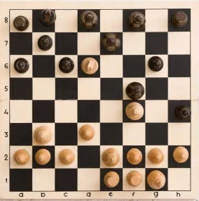
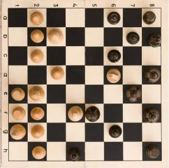
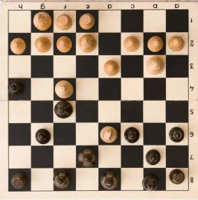
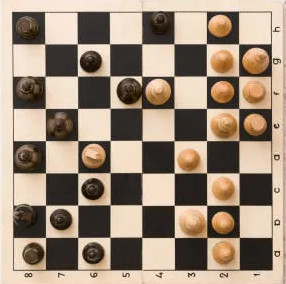

# Perceiving and Playing Chess

The paper can be found above [HERE](./dissertation.pdf)

Below details the instructions for installing the project dependencies and building

## Build Instructions & Configuration

From the root directory, create a venv and install packages if you have not done so yet

you can use the following commands

```bash
python -m venv venv
source ./venv/bin/activate # or venv\Scripts\activate if you're on windows
pip install -r requirements.txt
```

To run the project, make your way to `src` from the project root directory and execute the main script

```bash
cd src
python main.py
```

From here if you just wish to use the enigne follow the CLI instructions; Further detail on setting up Computer Vision Agents during this process can be found below

## Digital Human Engine Input

To make a move, first click the piece you wish to move then click the square you wish to move the piece to. Moves are guided by the current legal move set, so moves may not respond when in check

If moves struggle to respond look at the terminal output and see what square you are selecting.

## Camera Configuration

Helpful details for Camera configuration options presented within the CLI

1. Choose the device you wish to use, as far as cameras go this is usually 0 for you main camera but play about with it if it doesn't initially pick up the correct one
2. A helpful image guide for camera configuration can be seen below

|                 Image 1                  |                    Image 2                     |                     Image 3                     |                     Image 4                      |
| :--------------------------------------: | :--------------------------------------------: | :---------------------------------------------: | :----------------------------------------------: |
|  |  |  |  |
|         _0/360 Deg angle offset_         |             _90 Deg angle offset_              |             _180 Deg angle offset_              |              _270 Deg angle offset_              |

3. Configure as normal from here

## License details

found [HERE](./LICENSE)
